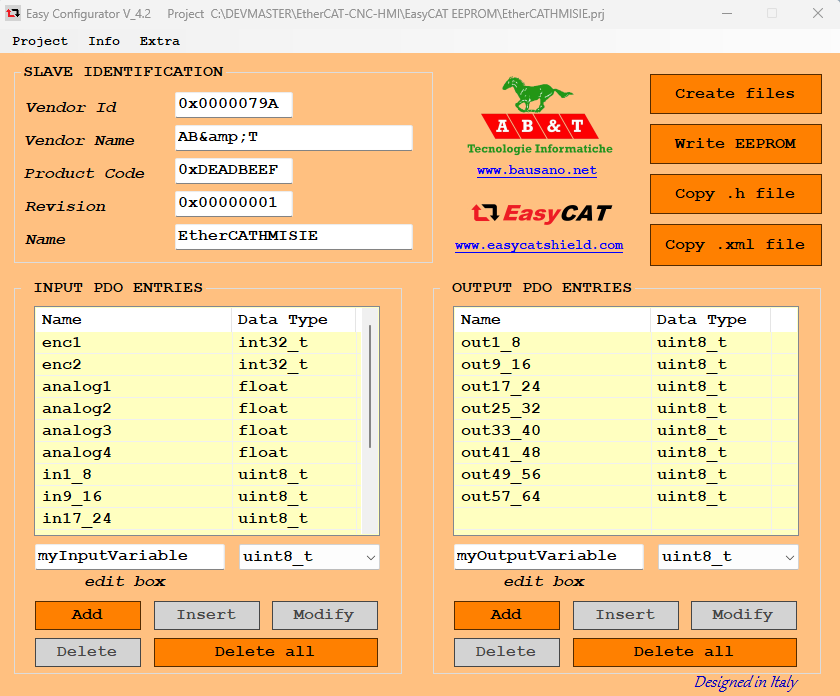
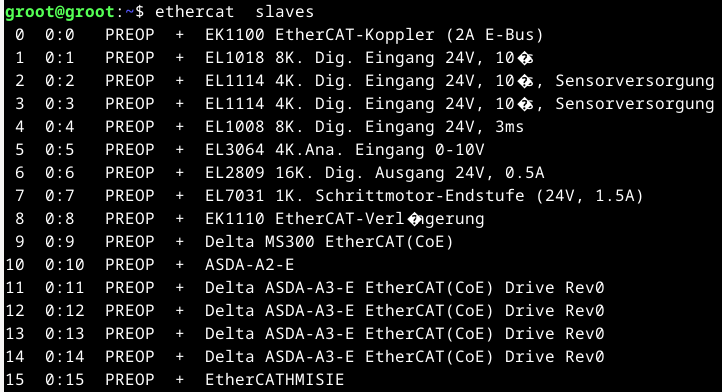
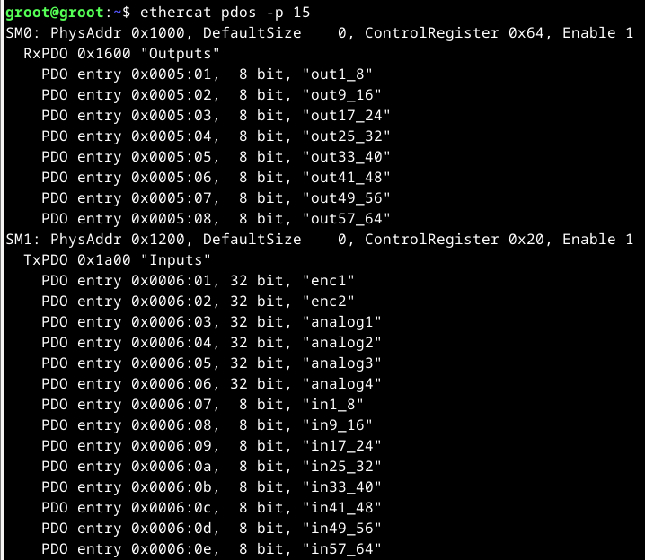

# EtherCAT CNC HMI

This project was created to interface an old Siemens machine control panel of a Sinumerik 840C (model: 6FC5103-0AD03-0AA0) to a DIY CNC machine using the EtherCAT protocol. While any EtherCAT based system can access the IO. It is strongly inspired by [previous work](https://github.com/Watze85/TWSSIO_V1.0_840C). In fact, it uses large parts of the research and the PCB design reagrding the setup with shift registers and the PCB layout. It furthermore uses the [EasyCAT Shield by Ab&T](https://www.bausano.net/en/hardware/easycat.html) and an Nucleo F303-RE development board as microcontroller.

While the PCB is tailored to the specific needs of the panel referenced above, the code is more universal. It exposes:
- 64 Digital IN
- 64 Digital OUT
- 4 Analog IN (based directly on the AI of the microcontroller)
- 2 Encoder Inputs (int 32bit)

For a map of pin to physical keys, see this [figure](https://github.com/Watze85/TWSSIO_V1.0_840C/blob/main/Bilder/Signale.png) in the previously listed repository.

The firmware was developed based on MBED OS and the EasyCAT library. Minutes changes were made, hence the sources include a copy of the library. Sources are available [here](https://github.com/GuiHue/EtherCAT-CNC-HMI-Code).

## Physical Setup
The system contains two PCBs. 
1) Interface board

    This board is designed to interface with the actual keyboard through two 64 pin connectors. It uses shift registers on input and output side to scale the MC inputs to 64 I/O respectively. Connection to the microcontroller board is done by a 20 pin connector.

    Power is supplied through the indicated connector. 8-30V DC are ok. For additional outputs, two blocks with separatepower supply are provided. Block one includes outputs  12,44,50,51-55 and block 2 outputs 56-63 . Voltage up to 24VDC is accepted. Total supply capacity is 1A per group. 

2) Microcontroller board

    This board mounts the micro controller and provides interfaces for two further AI and one ENC input. The onboard LED is a status indicator:
    - blinking: EasyCAT not initialized: Ususally means the shield is not working or missing
    - on: EasyCAT was initialized properly and the system is cycling
    - off: not powered   

3) Microcontroller Board Config

    Make sure to set power supply jumpers to external power supply when intending to operate the system. This   should be JP5 set to E5V. Check [manual](https://www.st.com/resource/en/user_manual/um1724-stm32-nucleo64-boards-mb1136-stmicroelectronics.pdf) if unsure.

4) Documentation

    All required files to make your own boards can be found in subfolder /pcb. They onclude schematics, BOM, PCB layout (PDF) and Gerber files. 

## EasyCAT Shield Setup
1) Download Easy Configurator V4.2

    - Download via Bausano: https://www.bausano.net/images/arduino-easycat/EasyConfigurator_V4_2.zip and unzip. No install required.
    - Program can be run by executing: EasyCAT_Config_GUI.exe from ./exe/ subfolder

2) Prepare EasyCAT Shield

    - Mount EasyCAT Shield on STM32
    - Power STM32 either through USB or external power source
    - connect IN Port of EasyCAT Shield with a standard ethernet cable to an ethernet port on your computer

3) Flash EasyCAT Shield
    - Download configuration file from here:
    - Start Easy Configurator, go to Project -> Open and select file from previous step
    - Check if information on display is identical to screenshot below
       
    - If yes: Select "Write EEPROM"
    - Wait for confirmation

## Microcontroller Firmware
1) Preparation
    This project was developed using the browser based version of Keil Studio. Please ensure that you have an account at [studio.keil.arm.com](https://studio.keil.arm.com/auth/login) and login.
2) Import Project
    - In your browser with keil studio go to File > Clone
    - Enter this the following URL in the URL field: https://github.com/GuiHue/EtherCAT-CNC-HMI-Code 
    - Enter a project name of your liking

    _NOTE_: The code repository is separate from this repo due to compatabilitiy with Keil Studio and its default project structure. 
    
3) Flash Firmware
    - Connect your Nucleo Board with the appropriate USB cable to your computer. Make sure that the power supply jumpers are set so that power is received via USB. Check the [manual](https://www.st.com/resource/en/user_manual/um1724-stm32-nucleo64-boards-mb1136-stmicroelectronics.pdf). For a Nucleo F-303RE it should be JP5 set to U5V.
    - Open the newly imported project, making sure the the desired project is the currently "Active project"
    - In the top right corner, go to "Build Target" and click to select a build target. Choose "NUCLEO-F303RE"  
    - Click "Build" (Hammer icon) and wait. This may take a few minutes. When done, a download will appear automatically (*.bin file). 
    - To flash the firmware, use the "Play" button. During startup of Keil Studio, your browser likely will ask for permission to access a USB device. This needs to be accepted.
    - After flashing, the console should indicate success.
    - Done.
    
    _Note:_ Code has been tested and is known to be working. That's about it. It is not optimized for speed or anything else.

## LinuxCNC
This project was developed to interface the control panel specifically with [LinuxCNC](https://linuxcnc.org/) using  [linuxcnc-ethercat](https://github.com/linuxcnc-ethercat/linuxcnc-ethercat) and a generic driver.

When connected and assuming that linuxcnc, ethercat master and linuxcnc-ethercat are installed correctly, the slave should show up when using the following command `ethercat slaves` as follows:

  

Command `ethercat pdos` should provide the following:

  

### ethercat-conf.xml

As can be seen in the EC EEPROM setup, the individual DI and DO are not packged in single index, but rather in complex entries of 8 bit each. For linuxcnc-ethercat the type "complex" must be used. A full example of a working ethercat-conf.xml can be found [here](linuxcnc\ethercat-conf-EtherCAT-CNC-HMI.xml).

_NOTE_: linuxcnc-ethercat has a hardcoded limit of how many pins can be exposed for a (generic) device. This number presently is 128. See [issue 429](https://github.com/linuxcnc-ethercat/linuxcnc-ethercat/issues/429) for more information on how to change this in the linuxcnc-ethercat code.

A more practical approach that does not break the update path via apt is to not use all 128 DIO. Specifically,the two groups of 8 outputs each listed above are not always in use. The XML example makes use of this approach and removes outputs 57-64 from the config in favour of analogin 1 and 2 as well as the encoder inputs. Play around as you wish. Check comments in XML file for further information. 

